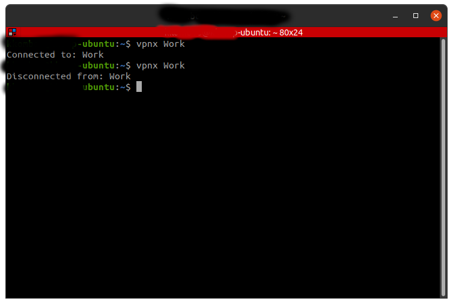

# vpnx

<h1>Connect/Diconnect to/from vpn + turn on/off proxy</h1>

- ### Requirements:

  - `nmcli`
  - Proxy settings configured through gnome menu

- ### Use case:

  

- ### Ideas for further versions:
  - Have `stdout` to show connection process when connecting to `VPN`.
- ### References:
  - <a href="https://stackoverflow.com/questions/478898/how-do-i-execute-a-command-and-get-the-output-of-the-command-within-c-using-po"  > C++ `exec()` example</a>
